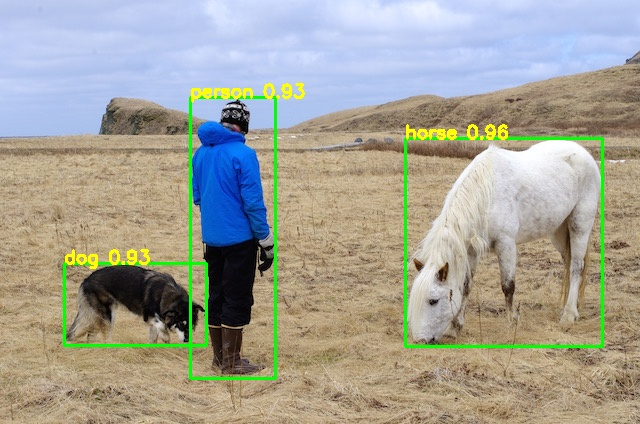
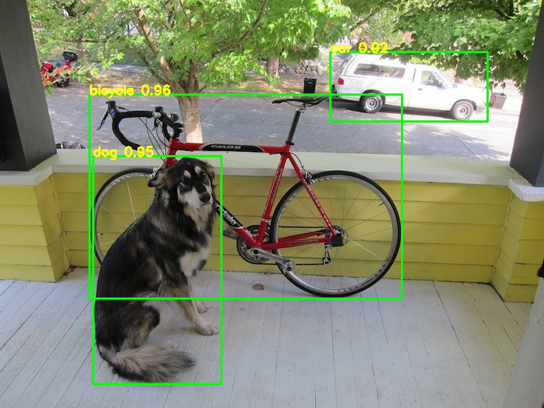
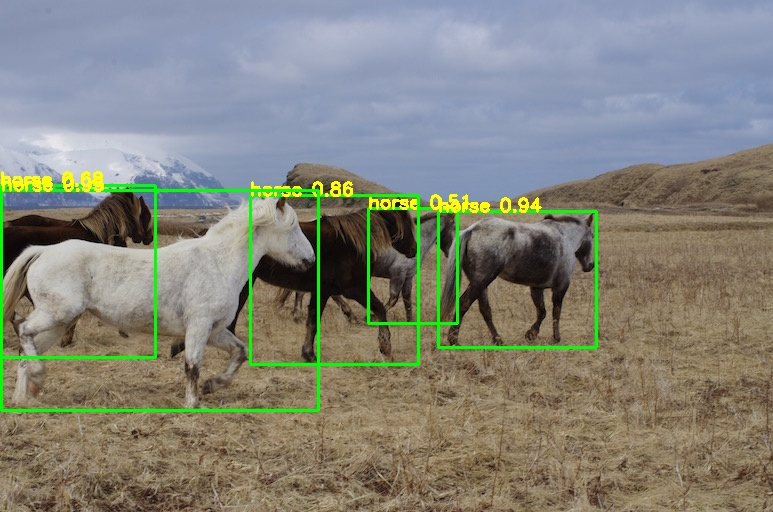
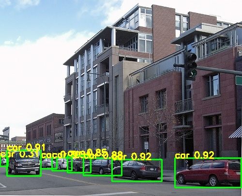

# YOLOV7_AnchorFree_Train_PyTorch
1000行代码完美复现YOLOV7-AnchorFree的训练和测试，精度、速度以及配置完全相同，两者模型可以无障碍相互转换

## 指标展示
|Model| train | test | net_size | mAP@0.5 | mAP@0.5:0.95 | FPS |
|-----|------|------|-----|-----|-----|-----|
| yolov7(train from yolov7-u6) | 0712 |	2007_test | 640x640 |	0.905 |	0.740 |	161 |
| **yolov7-anchor-free(ours)** | 0712 |	2007_test | 640x640 |	**0.906** |	**0.745** |	**161** |

## 效果展示
      
      

## 使用说明
### 要求
> Python >= 3.6 \
> PyTorch >= 1.7
### 数据集下载
```shell script
cd <path-to-voc>/
wget https://pjreddie.com/media/files/VOCtrainval_11-May-2012.tar
wget https://pjreddie.com/media/files/VOCtrainval_06-Nov-2007.tar
wget https://pjreddie.com/media/files/VOCtest_06-Nov-2007.tar
tar xf VOCtrainval_11-May-2012.tar
tar xf VOCtrainval_06-Nov-2007.tar
tar xf VOCtest_06-Nov-2007.tar
```
### 数据生成
```shell script
cd data/voc0712
python voc_label.py
cat 2007_train.txt 2007_val.txt 2012_*.txt > train.txt
cd ../../
python gen_val_data_shape.py #generate voc2007_test data with shape
```
### 预训练模型下载
[yolov7-u6-samylee.pth(提取码8888)](https://pan.baidu.com/s/11xl6V5zcSvBxC9W2-im2eA)
### 训练和测试
```shell script
python train.py
```
已训练好的模型：  
[yolov7_100.pth(提取码:8888)](https://pan.baidu.com/s/1N2qX4dkU01DJPUSdrLTkxg)   
```shell script
python detect.py
```
### 计算mAP
```shell script
python val.py
```
## 参考
https://blog.csdn.net/samylee    
https://github.com/WongKinYiu/yolov7/tree/u6
